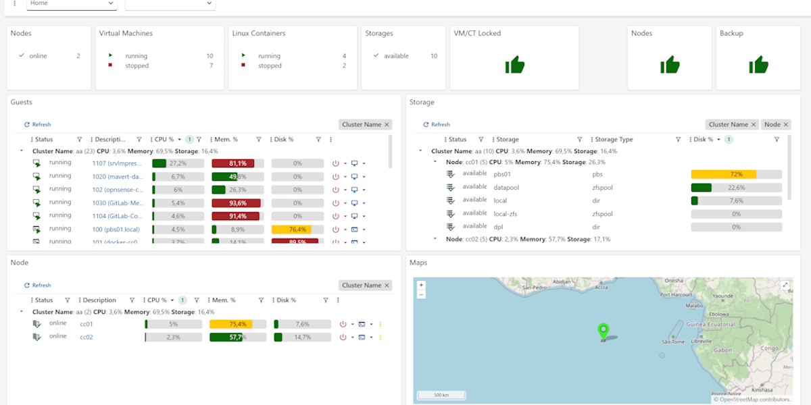

# cv4pve-admin


**Manage, Monitor, Decide.**
Enterprise management layer for Proxmox VE clusters.

*An enterprise approach tailored for IT to solve daily problems.*

[](LICENSE)
[](https://hub.docker.com/r/corsinvest/cv4pve-admin)
[](https://hub.docker.com/r/corsinvest/cv4pve-admin-ee)
[](https://gitlab.com/Corsinvest/cv4pve-admin)

---

## By IT Managers, for IT Managers

Proxmox VE manages the hypervisor. **cv4pve-admin manages your infrastructure.**

Built from real-world experience to solve real problems: multi-cluster visibility, proactive monitoring, compliance reporting, and enterprise automation.

**cv4pve-admin doesn't replace Proxmox VE** — it extends it to new frontiers. While Proxmox VE excels at managing individual nodes and VMs, cv4pve-admin addresses the operational challenges IT managers face daily: automated snapshot management across clusters, backup status verification and analytics, replication monitoring, infrastructure diagnostics, compliance reporting, and much more that enterprises need at scale.

**Because infrastructure management shouldn't require manual work cluster by cluster, node by node.**

---

## Key Features

### 🎯 Multi-Cluster Management
Centralized dashboard for all your Proxmox VE clusters. One control plane, unlimited clusters.

### 📊 Proactive Monitoring
Know if backups work BEFORE you need to restore. Find problems BEFORE they become critical.

### 🔄 Workflow Automation
Visual workflow designer for complex automation scenarios. Drag-and-drop builder, custom activities, enterprise scheduling.

### 📋 Compliance & Reporting
Automated diagnostics, backup analytics, audit reports. No manual work required.

### 🏗️ External Architecture
Runs completely outside Proxmox VE, communicating exclusively via REST API.
No installation on nodes. No system modifications. No dependencies.

### 🐳 Docker Ready
Deploy anywhere - container, VM, separate server. Production-ready Docker Compose included.

---

## Quick Start

**Linux/Mac:**
```bash
curl -fsSL https://raw.githubusercontent.com/Corsinvest/cv4pve-admin/master/install.sh | bash
```

**Windows PowerShell:**
```powershell
irm https://raw.githubusercontent.com/Corsinvest/cv4pve-admin/master/install.ps1 | iex
```

Access the web interface at `http://localhost:8080` with default credentials: `admin@local` / `Password123!`

**→ [Complete Installation Guide](https://corsinvest.github.io/cv4pve-admin/installation/)**

---

## Features & Modules

cv4pve-admin includes **15+ modules** covering monitoring, automation, health checks, backup analytics, and more.

For a complete feature comparison between **Community Edition (CE)** and **Enterprise Edition (EE)**, including:
- ✅ Module availability matrix
- 🚀 Feature roadmap and status
- 📊 Detailed capabilities comparison
- 🎯 Enterprise enhancements

**→ See the full documentation at [corsinvest.github.io/cv4pve-admin](https://corsinvest.github.io/cv4pve-admin)**

**📋 [Feature Comparison CE vs EE →](https://corsinvest.github.io/cv4pve-admin/editions/)**

---

## Requirements

- Proxmox VE 6.2 or later
- Docker (recommended for deployment)
- Or Linux/Windows server for binary deployment

---

## Documentation

**📖 [Complete Documentation →](https://corsinvest.github.io/cv4pve-admin/)**

- **[Installation Guide](https://corsinvest.github.io/cv4pve-admin/installation/)** - Quick start and Docker setup
- **[User Guide](https://corsinvest.github.io/cv4pve-admin/user_guide/)** - Features and configuration
- **[CE vs EE Comparison](https://corsinvest.github.io/cv4pve-admin/editions/)** - Choose the right edition

### Additional Resources
- [Docker Compose Deployment](src/docker/README.md) - Complete Docker setup guide
- [MCP Bridge for Claude Desktop](src/mcp-bridge/README.md) - AI assistant integration

---

## Architecture

**External Layer**: cv4pve-admin adds the management layer Proxmox VE is missing.

```
┌─────────────────────────────────────┐
│      cv4pve-admin (External)        │  ← Management Layer
│  Dashboard │ Workflows │ Analytics  │
└─────────────────────────────────────┘
                  ↕ REST API
┌─────────────────────────────────────┐
│         Proxmox VE Clusters         │  ← Hypervisor Layer
│   Cluster A │ Cluster B │ Cluster C │
└─────────────────────────────────────┘
```

Not a replacement - a completion. Automation, visibility, compliance, and control.

---

## Screenshots


*Multi-cluster dashboard with resource summary and real-time metrics*


*Backup job success rate, trends, and unprotected VM detection*


*Snapshot scheduling configuration with retention policies*

**→ See more screenshots in the [User Guide](https://corsinvest.github.io/cv4pve-admin/user_guide/)**

---

**Proxmox® is a registered trademark of Proxmox Server Solutions GmbH.**

---

## Support

- **Documentation**: [corsinvest.github.io/cv4pve-admin](https://corsinvest.github.io/cv4pve-admin)
- **Issues**: [GitLab Issues](https://gitlab.com/Corsinvest/cv4pve-admin/-/issues)
- **Website**: [www.corsinvest.it](https://www.corsinvest.it/cv4pve-admin)

---

## License

AGPL-3.0 License - see [LICENSE](LICENSE) file for details.


---

## About Corsinvest

cv4pve-admin is developed by [Corsinvest](https://www.corsinvest.it), specialists in Proxmox VE solutions.

**Real infrastructure management for real IT managers.**

---

<div align="center">

**Made with ❤️ by [Corsinvest](https://www.corsinvest.it) - We love Open Source**

</div>
