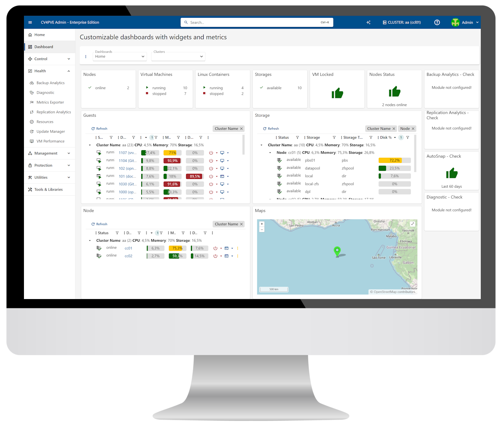
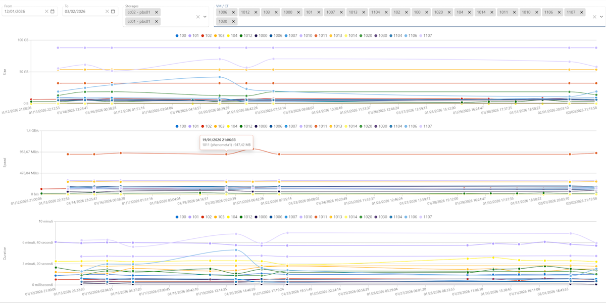
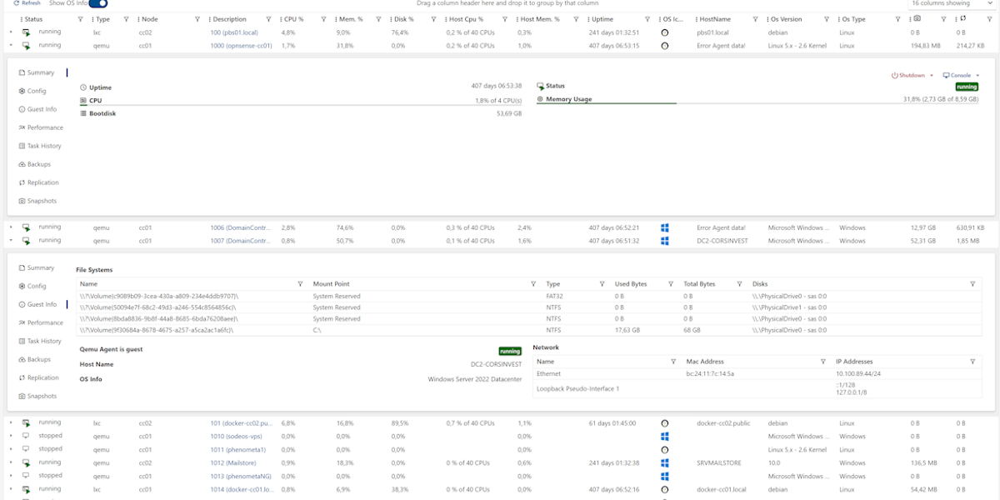
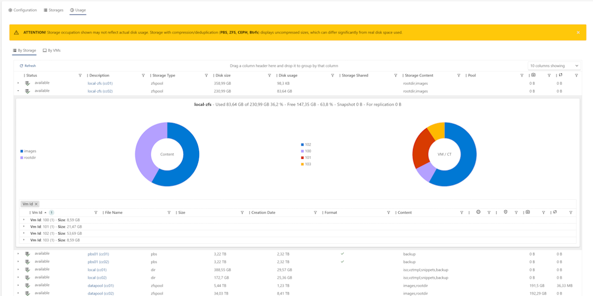

import { LinkButton } from '@astrojs/starlight/components';
import CtaBand from '@corsinvest/cv4pve-docs-theme/components/CtaBand.astro';
import Motto from '@corsinvest/cv4pve-docs-theme/components/Motto.astro';
import FeatureGrid from '@corsinvest/cv4pve-docs-theme/components/FeatureGrid.astro';
import proxmoxLogo from '../../assets/proxmox-logo.svg';

export const features = [
  { icon: 'desktop', title: "Unified Dashboard", text: "Monitor your entire infrastructure from one interface. Real-time metrics and resource tracking across all clusters.", href: 'modules/dashboard/' },
  { icon: 'laptop', title: "Secure VNC Proxy", text: "Access VM consoles without exposing Proxmox ports. Users connect to cv4pve-admin only.", href: 'modules/resources/' },
  { icon: 'padlock', title: "Security & RBAC", text: "Role-based access control, 2FA, App Tokens, and audit logs. Enterprise-grade access management.", href: 'configuration/admin-area/security/', ee: true },
  { icon: 'rocket', title: "Smart Automation", text: "[Automated snapshots](modules/autosnap/) with retention policies, [node config backup](modules/node-protect/) with Git push [EE], and [webhook hooks](modules/autosnap-webhook/) [EE].", href: 'modules/autosnap/' },
  { icon: 'analytics', title: "Advanced Analytics", text: "Deep insights into [backups](modules/backup-analytics/), [replication](modules/replication-analytics/), [storage](modules/resources/), and [VM performance](modules/vm-performance/) [EE]. Make data-driven decisions.", href: 'modules/backup-analytics/' },
  { icon: 'comment-alt', title: "Notifications", text: "CE: email and webhook. EE: 140+ services including Telegram, Slack, Discord, Teams, and more.", href: 'configuration/admin-area/notifier/' },
  { icon: 'approve-check-circle', title: "Infrastructure Diagnostics", text: "Automated health checks across your entire cluster. Detect configuration issues before they become outages.", href: 'modules/diagnostics/' },
  { icon: 'document', title: "System Reports", text: "Reports on clusters, nodes, VMs, and storage, for audits and capacity planning.", href: 'modules/system-report/' },
  { icon: 'magnifier', title: "Command Palette", text: "Press [[Ctrl+K]] to go to any page without the mouse.", href: 'modules/command-palette/' },
];

export const help = [
  { icon: 'github', title: "Community Support", text: "GitHub Issues and Discussions.", href: 'https://github.com/Corsinvest/cv4pve-admin/issues' },
  { icon: 'email', title: "Enterprise Support", text: "Priority email.", href: 'mailto:support@corsinvest.it' },
  { icon: 'external', title: "Website", text: "More information and resources.", href: 'https://corsinvest.it/cv4pve-admin-proxmox/' },
];

<Motto />

<em>Professional Proxmox VE management interface</em>

Proxmox VE manages the hypervisor. **cv4pve-admin manages your infrastructure.**

Built from real-world experience to solve real problems: multi-cluster visibility, proactive monitoring, compliance reporting, and enterprise automation.

**cv4pve-admin doesn't replace Proxmox VE**: it extends it. Proxmox VE excels at managing individual nodes and VMs. cv4pve-admin addresses the operational challenges sysadmins face daily: automated snapshot management across multiple clusters, backup status verification and analytics, replication monitoring, infrastructure diagnostics, compliance reporting, and more.

**Because infrastructure management shouldn't require manual work cluster by cluster, node by node.**

---

## Why cv4pve-admin?

Proxmox VE is a great hypervisor, but it wasn't designed for multi-cluster operations, compliance, or enterprise automation.
cv4pve-admin fills that gap: one interface, all clusters, all the tools your team needs to run infrastructure at scale.

<FeatureGrid items={features} />

---

## Editions

cv4pve-admin is available in two editions:

- **Community Edition** - Free and open source (AGPL-3.0) with core features
- **Enterprise Edition** - Commercial license with advanced modules (VM Performance, UPS Monitor, Apprise notifications, AutoSnap webhooks, Portal, Workflow, and more) plus priority support

<LinkButton href="editions/">Compare Editions →</LinkButton>

---

## Screenshots

---

## Getting Help

<FeatureGrid items={help} />

---

## Open Source & Transparent

cv4pve-admin Community Edition is **100% open source** under AGPL-3.0 license.

- **GitHub Repository:** [Corsinvest/cv4pve-admin](https://github.com/Corsinvest/cv4pve-admin)
- **Docker Images CE:** [corsinvest/cv4pve-admin](https://hub.docker.com/r/corsinvest/cv4pve-admin)
- **Docker Images EE:** [corsinvest/cv4pve-admin-ee](https://hub.docker.com/r/corsinvest/cv4pve-admin-ee)
- **Issue Tracking:** [Public issues and feature requests](https://github.com/Corsinvest/cv4pve-admin/issues)
- **Contributing:** [Pull requests welcome](https://github.com/Corsinvest/cv4pve-admin/pulls)

<CtaBand
  title="Ready to Get Started?"
  text="Install cv4pve-admin in under 2 minutes"
  primary={{ label: 'Install Now', href: 'getting-started/' }}
  proxmoxLogo={proxmoxLogo}
/>
