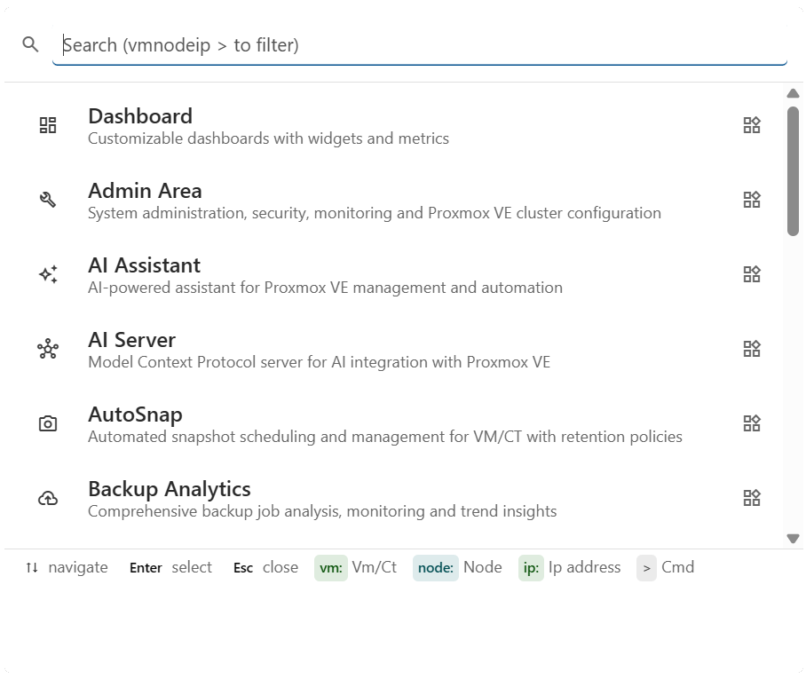
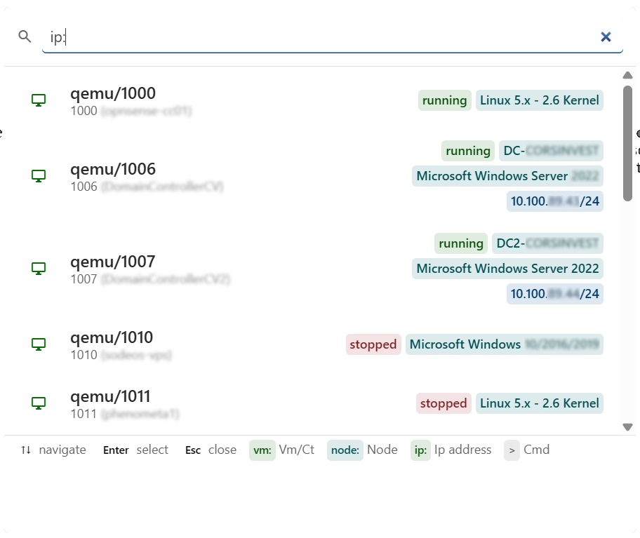
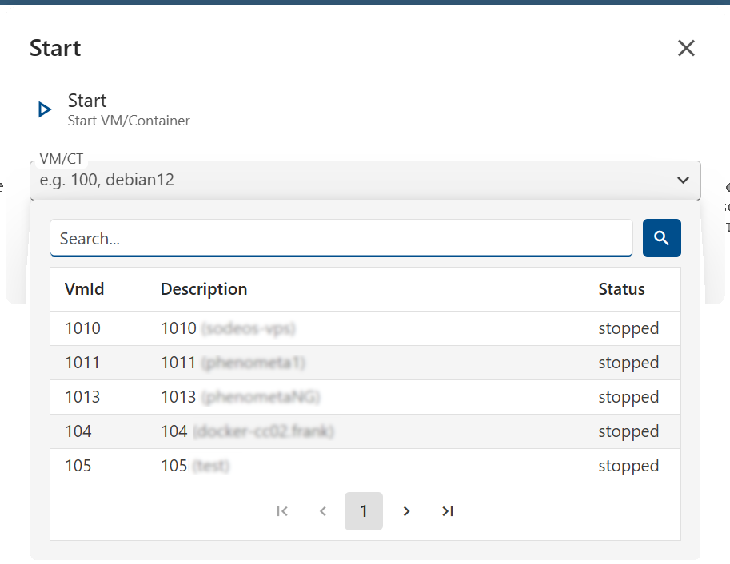

import Mdi from '~/components/Mdi.astro';
import PvePrivileges from '~/components/PvePrivileges.astro';
import FeatureGrid from '@corsinvest/cv4pve-docs-theme/components/FeatureGrid.astro';
import Tag from '~/components/Tag.astro';

<Mdi name="magnify" size="lg" /><Tag kind="all-clusters" /><Tag kind="per-cluster" />

Keyboard-driven access to modules, navigation and Proxmox VE operations, without leaving your current page. The palette is always available. Some result types and commands appear only when a specific cluster is selected.

## Features

<FeatureGrid
  items={[
    { icon: 'mdi:keyboard', title: "Single shortcut, anywhere", text: "`Ctrl+K` opens the palette from any page, as does a click on the **Search...** box in the header. `↑` `↓` to move, `Enter` to execute, `Esc` to close." },
    { icon: 'mdi:magnify-scan', title: "Mixed search", text: "One textbox for modules, QEMU VMs, nodes and commands. Plain text searches the modules. The prefixes (`vm:`, `node:`, `ip:`, `>`) switch to guests, nodes and commands.", href: '#search-behaviour' },
    { icon: 'mdi:flash', title: "Quick PVE actions", text: "`start`, `stop`, `restart`, `console`, `create snapshot`: operate on any VM/CT without clicking through the resource grid." },
    { icon: 'mdi:shield-account', title: "Permission-aware", text: "Results are filtered by the cv4pve-admin permissions of the current user. Commands the user can't execute don't appear.", href: '#application-permissions' },
    { icon: 'mdi:form-textbox', title: "Parameter dialogs", text: "Commands that need input open a typed parameter dialog (VM picker, text, boolean): no command-line syntax to remember." },
    { icon: 'mdi:filter-variant', title: "Context-aware footer", text: "The footer lists the prefixes available in your current cluster context, so you see what you can search for." },
  ]}
/>

## Why

Why a palette when you already have a sidebar?

<FeatureGrid
  items={[
    { icon: 'mdi:keyboard', title: "Zero clicks, zero scrolling", text: "Open the palette from anywhere with a keystroke: no menus to navigate, no long resource grids to scroll." },
    { icon: 'mdi:identifier', title: "Stops working with VM IDs in your head", text: "Type `vm:web` to list the matching VMs of the selected cluster. You do not need to remember which node or storage hosts what.", href: '#search-behaviour' },
    { icon: 'mdi:play-circle', title: "Trigger ops without the resource page", text: "Type `>start` and pick a VM: the VM starts. No need to open Resources, find the row and click its menu." },
    { icon: 'mdi:magnify', title: "Find by what you remember", text: "Lost a VM but know its IP? `ip:192.168.1` lists every matching VM. The ID, the name and the Proxmox VE tags are searchable too.", href: '#search-behaviour' },
  ]}
/>

## Reference

### All search prefixes

| Prefix | Filters | Example | Scope |
|--------|---------|---------|-------|
| none | Modules, by name or description | `backup` | <Tag kind="all-clusters" /> |
| `vm:` | QEMU VM by ID, name or Proxmox VE tag | `vm:100`, `vm:web` | <Tag kind="per-cluster" /> |
| `node:` | Node by name | `node:pve1` | <Tag kind="per-cluster" /> |
| `ip:` | QEMU VM by IPv4 address (also by ID, name or tag) | `ip:192.168` | <Tag kind="per-cluster" /> |
| `>` | Commands only | `>start` | <Tag kind="all-clusters" /> |

`vm:` and `ip:` currently return QEMU virtual machines only: LXC containers are not listed. The text after a prefix can be separated by a space: `vm: debian` works as `vm:debian`.

### All commands

Commands open a dialog if they require parameters. PVE commands operate on the currently selected cluster.

| Command | Description | Parameters | Scope |
|---------|-------------|------------|-------|
| `logout` | Log out the current user | - | <Tag kind="all-clusters" /> |
| `start` | Start a stopped VM / Container | VM / CT (the picker lists the stopped guests) | <Tag kind="per-cluster" /> |
| `stop` | Stop a running VM / Container (stop, not shutdown) | VM / CT (the picker lists the running guests) | <Tag kind="per-cluster" /> |
| `restart` | Reboot a running VM / Container | VM / CT (the picker lists the running guests) | <Tag kind="per-cluster" /> |
| `console` | Open the NoVnc web console | VM / CT (the picker lists the running guests) | <Tag kind="per-cluster" /> |
| `create snapshot` | Create a VM / CT snapshot | VM / CT (the picker lists the running guests), **Name** (required), **Description**, **Include RAM** | <Tag kind="per-cluster" /> |

The command runs as soon as the dialog is confirmed, and its outcome is shown as a notification.

### Result rows anatomy

Each row shows an icon (color-coded by category), title, subtitle and status badges (running / stopped, hostname, OS, lock). The row ends with an indicator: `open_in_new` if the command opens a dialog, `bolt` for instant actions.

Result types: **Module** · **VM** · **Node** · **Command**.

The hostname, OS and IP address badges are filled in only by an `ip:` search. Selecting a module opens it. Selecting a VM or a node opens it in the [Resources](../resources/) module.

## Search behaviour

No row is selected while you type: press `↓` to select one and `Enter` to run it, or click the row.

The query is split on spaces. A word starting with a known prefix (`vm:`, `node:`, `ip:`) selects what to search. Everything else, including the value after the prefix, is joined back into one search phrase.

- With an empty query the palette lists the modules. Type `>` to list the commands.
- Without a prefix the search covers the modules only. Guests and nodes need `vm:`, `ip:` or `node:`; commands need `>`.
- The phrase is matched, ignoring case, against the title and subtitle of the row. For VMs it is also matched against the Proxmox VE tags and, with `ip:`, the IP addresses.
- The phrase is **not** matched against the badges (status, hostname, OS): `vm:100 stopped` doesn't work. To filter by state, use the [Resources](../resources/) module.
- Only one resource filter takes effect at a time: combining `node:` and `vm:` falls back to `node:`.
- A non-empty query shows the first 15 results.
- Modules are listed only when at least one cluster is enabled.
- `ip:` reads the addresses of the running VMs through the QEMU Guest Agent, so it is slower than `vm:`. An address is found only on VMs that have the agent. Only IPv4 addresses are searched.
- The footer of the palette lists the prefixes available in your current cluster context.

**Console authentication:** `console` requires the WEB API of the cluster to use **Credential** authentication. With **API Token** authentication the command only shows a notification asking to switch to the Credential access type.

**Cluster context:**

- <Tag kind="all-clusters" /> entries (modules navigation, `logout`, the `>` command filter) are always there.
- <Tag kind="per-cluster" /> entries (VM / Node search, PVE commands) appear **only when a cluster is selected**. The search covers that cluster only. Modules that work on a single cluster are listed only when a cluster is selected, too.

## Application permissions

The palette itself needs no permission. What it shows depends on the permissions of the user:

| Entry | Required permission |
|-------|---------------------|
| Module | The access permission of that module |
| VM, node | The cluster permissions of the user on that resource |
| `start`, `stop`, `restart` | VM **Power Management** on the selected cluster |
| `console` | VM **Console** on the selected cluster |
| `create snapshot` | VM **Snapshot manager** on the selected cluster |
| `logout` | none |

<PvePrivileges module="command-palette" />
