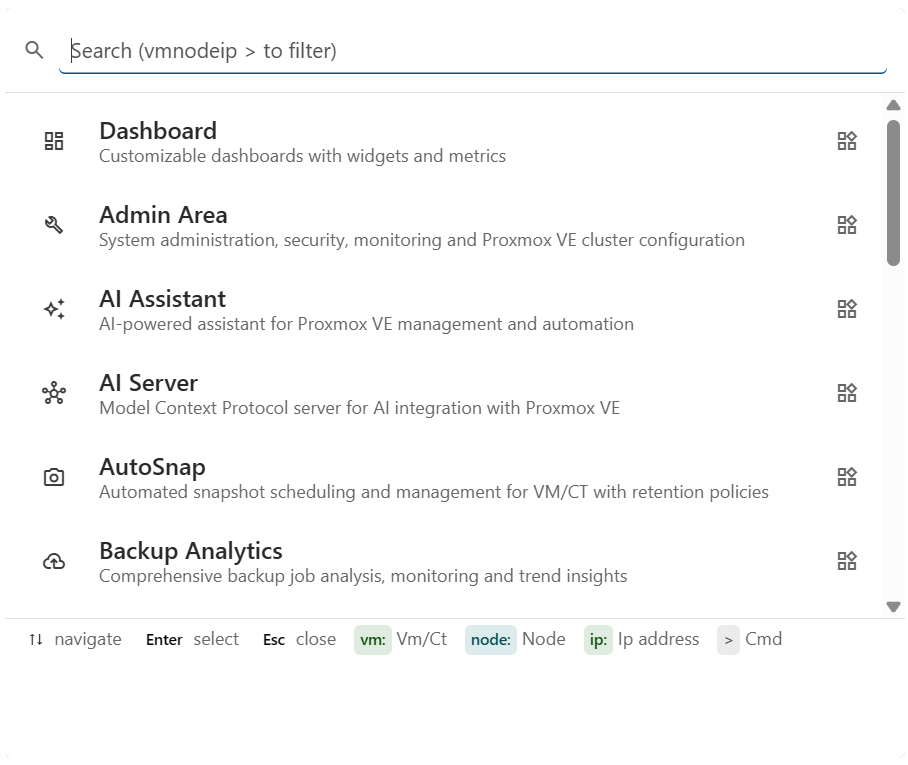
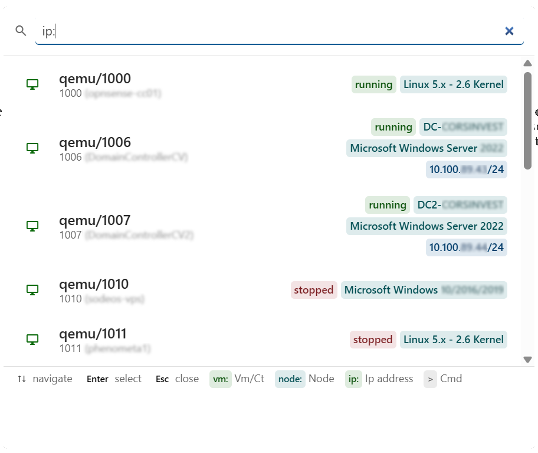
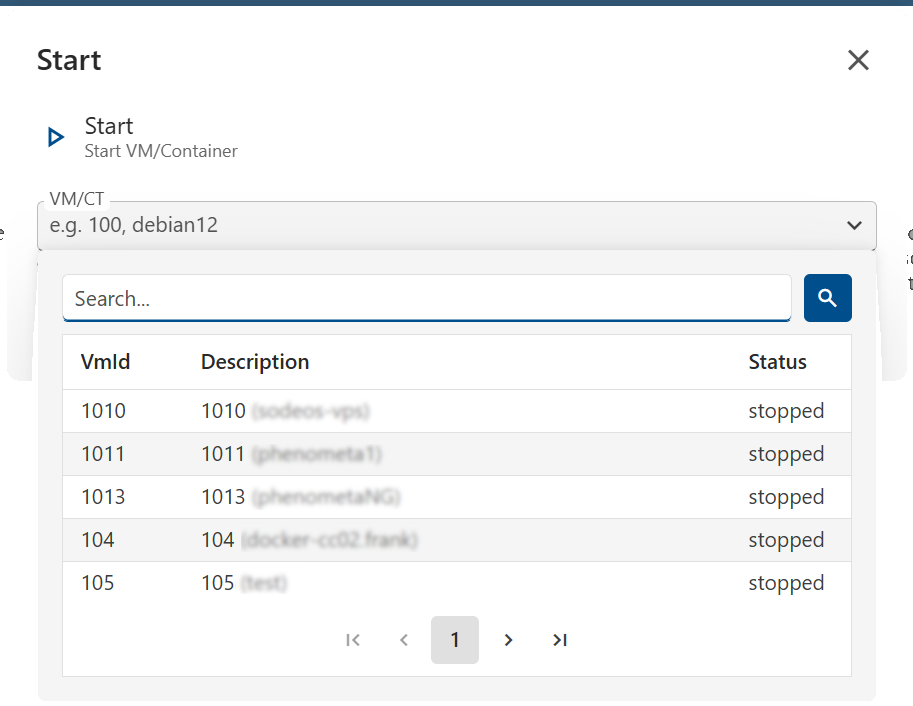

# :material-magnify: Command Palette  

Keyboard-driven access to modules, navigation and Proxmox VE operations — without leaving your current page. The palette is always available; some result types and commands appear only when a specific cluster is selected.

{ .screenshot }

## Features

-   :material-keyboard:{ .lg .middle } **Single shortcut, anywhere**

    ---

    `Ctrl+K` (or `Cmd+K` on macOS) opens the palette from any page. `↑` `↓` to move, `Enter` to execute, `Esc` to close.

-   :material-magnify-scan:{ .lg .middle } **Mixed search**

    ---

    One textbox spans modules, VMs / containers, nodes and commands. Prefix tokens (`vm:`, `node:`, `ip:`, `>`) narrow the scope on demand.

-   :material-flash:{ .lg .middle } **Quick PVE actions**

    ---

    `start`, `stop`, `restart`, `console`, `create snapshot` — operate on any VM/CT without clicking through the resource grid.

-   :material-shield-account:{ .lg .middle } **Permission-aware**

    ---

    Results are filtered by the current user's PVE permissions; commands the user can't execute don't appear.

-   :material-form-textbox:{ .lg .middle } **Parameter dialogs**

    ---

    Commands that need input open a typed parameter dialog (VM picker, text, boolean) — no command-line syntax to remember.

-   :material-filter-variant:{ .lg .middle } **Context-aware footer**

    ---

    The footer dynamically lists the prefixes available in your current cluster context, so you always see what you can search for right now.

## Why

Why a palette when you already have a sidebar?

!!! tip "Zero clicks, zero scrolling"
    Open from anywhere with a keystroke — no breaking your flow to navigate menus or scroll long resource grids.

!!! success "Stops working with VM IDs in your head"
    Type `vm:web` and the matching VMs surface across **every** cluster — no need to remember which node or storage hosts what.

!!! info "Trigger ops without the resource page"
    `>start` + pick a VM = started. No need to open Resources, find the row, click the kebab — three keystrokes total.

!!! warning "Find by what you remember"
    Lost a VM but know its IP? `ip:192.168.1` lists every guest matching. Hostname, OS, tags also searchable.

## Reference

??? note "All search prefixes"

    | Prefix | Filters | Example | Scope |
    |--------|---------|---------|-------|
    | `vm:` | VM / Container by ID or description | `vm:100`, `vm:web` |  |
    | `node:` | Node by name or description | `node:pve1` |  |
    | `ip:` | VM / Container by IP address | `ip:192.168` |  |
    | `>` | Commands only | `>start` |  |

??? note "All commands"

    Commands open a dialog if they require parameters. PVE commands operate on the currently selected cluster.

    | Command | Description | Parameters | Scope |
    |---------|-------------|------------|-------|
    | `logout` | Log out the current user | – |  |
    | `start` | Start a stopped VM / Container | VM / CT |  |
    | `stop` | Stop a running VM / Container | VM / CT |  |
    | `restart` | Restart a running VM / Container | VM / CT |  |
    | `console` | Open web console (NoVnc / Xterm.js / Spice) | VM / CT |  |
    | `create snapshot` | Create a VM / CT snapshot | VM / CT, name, description, include RAM |  |

??? note "Result rows anatomy"

    Each row shows an icon (color-coded by category), title, subtitle, status badges (running / stopped, hostname, OS, lock) and a final indicator — `open_in_new` if the command opens a dialog, `bolt` for instant actions.

    Result types: **Module** · **VM / CT** · **Node** · **Command**.

## Search behaviour

{ .screenshot }

The query is tokenised on spaces. Each token is either a `prefix:value` filter or free text; without a prefix the search spans modules, VMs, nodes and commands.

- Free text matches `Title`, `Subtitle` and tagged extras (hostname, OS, IPs) — **not** status badges. `vm:100 stopped` doesn't work; use the [Resources](resources.md) module to filter by state.
- Only one resource filter takes effect at a time — combining `node:` and `vm:` falls back to `node:`.
- The footer of the palette lists the prefixes available in your current cluster context.

{ .screenshot }

!!! warning "Console authentication"
    `console` requires the WEB API to use Credential authentication (PAM user). It is disabled with API Token authentication.

!!! info "Cluster context"
    -  entries (modules navigation, `logout`, the `>` command filter) are always there.
    -  entries (VM / CT / Node search, PVE commands) appear **only when a single cluster is selected**. Switching to **All Clusters** hides them.
